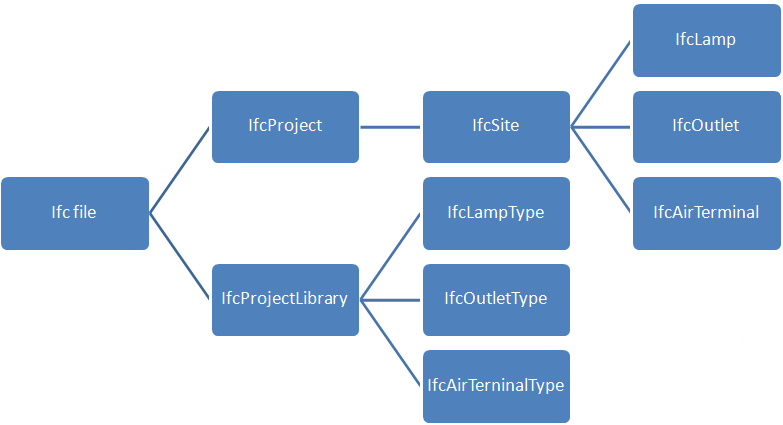
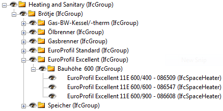

Waltham, 13th March 2013

Implementers Agreement: Product Libraries in Ifc format

Ifc Product Libraries containing one or more products with properties and geometry 

**Proposal By: Bjørn K Stangeland, Data Design System ASA **

Timeline: 

Oct. 25th 2011  	: Project idea presented for ISG (Budapest)

Nov. 4th 2011   	: Project proposal distributed (to a ISG sub group) for initial feed-back

Mar. 5th 2012    	: Project proposal with scope presented for ISG (Washington DC)

Mar. 6th 2012	: ISG set up a task force to create an Implementers Agreement (Washington DC)

Mar. 21st 2012	: Project status presented for ITM/IUG (Oslo)

Sep. 24th 2012	: ISG accepted the Implementers Agreement (Helsinki)

Oct. 14th 2012	: ITM approval of the IA (Tokyo)

Mar. 12th 2013	: Extended [specification](http://www.dds-cad.net/files/net.dds-cad.com/downloads/Presseberichte/2013_03_11_IFC_for_Object_Libraries_spesification.pdf) presented for ISG/ITM/IUG as a new IA

**Approved: **Implementers Support Group meeting in Waltham (USA) 12th March 2013

**Table of Contents**

[[TOC]]

# Implementation Agreement Proposal

## #CV-2x3-xxx

number		PLV-2x4-001

based on 	IFC2x3

effects		*"IFC2x3 Coordination View 2.0" – IA defined relative to CV2.0*

*Can also be perceived as a precursor for "Ifc2x4 Product Library View 1.0"  *

date		March 2013

revision 	V 0.01

initiator		Bjørn K Stangeland

summary	**How to structure an Ifc file containing a Product Library.**

### Description

Using Ifc for Product Libraries requires an agreement for where/how to find information if the FILE_DESCRIPTION attribute contains ' ViewDefinition [ProductLibraryView_Vxx]' 

The actual objects containing product information is not affected by this agreement, compared to existing implementations of i.e. coordination view 2.0.

The main differences compared with the official coordination view 2.0, is that it’s allowed with more than two geometric representations of each object and the use of external document references for additional product information.

An Ifc product library file does not (necessarily) contain "a traditional spatial structure" or an IfcSystem grouping individual objects/products together into a design/model. This agreement therefore describes how products/objects should be grouped and contained.

This IA specification can be used for both Ifc2x3 and Ifc4. The few differences between Ifc2x3 and Ifc4 product libraries are commented in the requirements section.

# Background

## Suitability of Ifc 

The advantages of choosing the buildingSMART datamodel (Ifc) as the format to distribute and share product information are many.  Ifc is well documented,  is an open standard, has powerful and flexible mechanisms to attach properties to objects, has the possibility of holding geometry, has grouping mechanisms, can use properties defined in buildingSMART Data Dictionary (bSDD), has external reference capabilities (i.e URL’s) etc. 

## Scope

A classical Ifc model contains specific buildings, storeys, spaces, building elements, relations between objects etc. An Ifc Product Library basically contains one or more single products/objects.

In scope are "type objects", property sets, geometry representation(s) (2D/3D), different detail levels of 3D geometry, “virtual geometry” (access, operation zones etc.), link to preview “pictures” of objects,  external document references (i.e. URL’s with PDF files), grouping mechanisms,  buildingSMART dictionary (IFD) references, classification , use with various units (metric, imperial) etc.

An Ifc Product Library can also be used to distribute and share definitions of "layered compositions" such as wall types.

## Limitation

Ifc does currently does not provide "parametric definition" of objects or properties. However future extension is an on-going development that probably will provide also this capability. Proprietary solutions and services that provide generation (export) of Ifc could however very well use Ifc to distribute the “static” result of a “product” generated from parametric to Ifc compliant software.

## Out of scope

This document does **not** specify which information/properties that should be mandatory and optional for the individual types/categories of products in a Product Library. 

Such specifications/requirements are produced by the buildingSMART Product Room and requirement definitions for a specific product/object is referred to as a "Product Template/Exchange Requirement" in this agreement.

# Proposed Requirements

## Ifc schema versions supported

Ifc2x3, Ifc4 or simple IfcXML can be used for product libraries. 

**FILE_DESCRIPTION**

The *FILE_DESCRIPTION* attribute of ViewDefinition should be "**ProductLibraryView**" followed by the version of this agreement (currently “_V1.0”).

Example:

ISO-10303-21;

HEADER;

FILE_DESCRIPTION((' ViewDefinition [ProductLibraryView_V1.0]' , 'ExchangeRequirement[ER_SPie_xxx, ER_FMie_yyy]'), '2;1');

**IfcProject**** **

The *Name* attribute should contain **name of the Product Library**. Relevant *RepresentationContexts* and *UnitsInContext* needs to be defined.

**IfcSite** 

*IfcSite* is used as **placeholder for occurrence objects **(the products).

 (Note: This spatial element is regarded as a "dummy object".)

**IfcProjectLibrary **

*IfcProjectLibrary* should contain all type objects. (Only relevant for Ifc4)

**IfcGroup**

*IfcGroup* should be used to **organizing products into categories**. 

One *IfcGroup* can contain one or more *IfcGroup*’s, to build tree structures.

The *Name* attribute should be a human readable name of the group.

One occurrence object (product) may be referenced from more than one *IfcGroup*.

## Occurrence objects

An occurrence object defines one actual "product" and should refer to the spatial placeholder (*IfcSite*). 

The *Name* attribute is a product identifier (name, product number etc.). 

The *Description* attribute should be used for the products description text. 

Each occurrence object occurrence will link to a corresponding type object. 

**Several occurrence objects **(products)** may refer to the same type object.**

If a property is defined both on the occurrence and type object, the occurrence definition should be used. 

*IfcXXX.Name*  		- Product identifier (name, product number etc.).

*IfcXXX.Description*   	- The products description text

*IfcXXX.ObjectType*  	- Function category (optional)

## Type objects

Each [occurrence object](http://www.buildingsmart-tech.org/ifc/IFC2x4/rc3/html/schema/chapter-3.htm#object-occurrence) should have a corresponding [type object](http://www.buildingsmart-tech.org/ifc/IFC2x4/rc3/html/schema/chapter-3.htm#object-type), where the type object describes common characteristics for all occurrence objects referring to it. Such characteristics include common properties, shapes, materials, composition, and other concepts described at particular entities. 

*IfcXXX.Name*  		- Product identifier (name, product number etc.).

*IfcXXX.Description*   	- The products description text

*IfcXXX.ObjectType*  	- Function category (optional)

*IfcXXX.Tag* 		- Optional: identification/serial-number/EAN code etc.

## IfcDocumentReference 

**_IfcDocumentReference_** is used for all references to external documents.

<table>
  <tr>
    <td></td>
    <td>
IfcDocumentReference.Location could be a URL or a local file.
</td>
  </tr>
</table>

If local external files should be distributed with the ifc file, it’s agreed to use the ifczip format with the Ifc file in the root of the zip file and all referenced files inside a folder named "_ExternalRefs_". 

## IfcDocumentInformation 

**_IfcDocumentInformation_** should be used for the external documents metadata.

*IfcDocumentInformation .***_Purpose_**** **is used to define the purpose of the document with regards to Product Information. 

Implementers agreements and Exchange Requirements (templates) will define agreed "purpose" identifiers such as “Image”, “Certificate”, “Product Data Sheet”, “Maintnance Instructions” etc.

NOTE: A special agreement is made for a quick en easy mechanism to use bitmaps or other external graphics to provide a preview picture of the object. If the IfcDocumentReference. **Name** attribute is set to "**_ExternalRefs_Image**", the Location attribute will refer to an image that can be used as a **preview** or thumbnail of the product.

## IfcShaprepresentation

Product library objects will be allowed to have **multiple geometric representations.**

This allows for presenting products in both 2D and 3D and also in several detail levels.

Multiple *IfcShaprepresentation* with different *RepresentationIdentifier* must be used to separate geometrical representations for different purposes. 

There must be a corresponding *IfcGeometricRepresentationSubContext* for each *RepresentationIdentifier*.

*IfcGeometricRepresentationSubContext* is used to classify the representations as operational space and/or safety zone.  

## IfcClassification

Products can have several classifications defined by *IfcClassification*. This may also be used for manufacturer’s product number, UniCode, Omniclass or other relevant product classifications.

*IfcClassification.Name	   *	- Name of a «table/system» products are classified within

*IfcClassification.Edition* 	- For example  "NS3451 2009"

## IfcClassificationReference

*IfcClassificationReference.ItemReference* – The reference within a classification system

*IfcClassificationReference.Location* – URL or look-up

*IfcClassificationReference.Name* – Description text

*IfcClassificationReference.ReferencedSource* – Reference to IfcClassification

## IfcPort

Relevant objects/products (electrical, plumbing, ventilation etc.) must have IfcPort’s defined for all connection points. 

# Further explanations and examples

Most of the issues here commented is already covered by the basic Ifc specification, implementation guidelines and existing Model View Definitions. However this section does contain some additional clarifications relevant for the agreement for Product Libraries

## File structure

An Ifc Product Library must contain the entities **IfcProject **and **IfcSite**  (For Ifc4  **IfcProjectLibrary** must be present in addition)

**IfcProject **is used the same way as in Ifc files containing "BIM model assemblies" (buildings; systems etc). This includes the definition of default units.

**IfcSite** is used for the purpose of having a "spatial element" as place holder for occurrence objects (the products).  (Note: This spatial element is regarded as a “dummy object”. For compatibility reasons, implementations should check if IfcBuilding has been used instead of IfcSite as the “dummy” spatial placeholder for the occurrence objects)

**IfcProjectLibrary** should contain all type objects. (Only relevant for Ifc4)

Each occurrence object occurrence will link to a type object. 

**Several occurrence objects **(products)** may refer to the same type object (**product definition). 

## Properties and property sets

Properties and property sets should in general be defined on type objects.

In cases where multiple occurrence objects refer to the same type object, properties that are unique for the specific "product" may be defined on the occurrence object. (For example if the type same object is being referenced by several occurrence objects (products))

Properties defined on the occurrence object will take precedence over properties defined on the referenced type object.

## Geometry

The geometry should in general follow the same implementer’s agreements as for "Coordination View 2.0", but with some exceptions:

**Geometry should in general be attached to the type object**, not the occurrence object.

Product library objects will be allowed to have **multiple geometric representations.**

This allows for presenting products in both 2D and 3D and also in several detail levels.

This also allows for new kinds of geometric representations for various purposes. 

One example would be geometry visualizing how much surrounding space a product needs in operation and/or safety distances. 

Using a door as an example, the operating space representation will be the space the door needs to open without being obstructed. 

Multiple *IfcShaprepresentation*’s with different *RepresentationIdentifier* must be used to separate geometrical representations for different purposes. 

There must be a corresponding *IfcGeometricRepresentationSubContext* for each RepresentationIdentifier.

This is the same concept as for Coordination View 2.0 but without the limitation of maximum two instances of *IfcGeometricRepresentationContext* as defined in Implementers Agreement #CV-06-106 .

*IfcGeometricRepresentationContext.ContextType* = 'Model' 

*IfcGeometricRepresentationSubContext.ContextIdentifier*=’Body’

*IfcGeometricRepresentationSubContext* should (when relevant) be used to classify different representations such as operational space, safety zone  etc. 

If a product definition contains several geometric **detail levels** (the default is the preferred detail level to be used with large BIM models), the *ContextIdentifier* attribute should be used to separate them.

Extensions to the list with official and recognizable *ContextType* and *ContextIdentifiers* will be subject for discussion within buildingSMART Implementers Support Group (ISG) and published as updates to this agreement.

## Origin, scale and direction for single object geometry

Different types of objects/products will in most cases have their own requirements for position, scaling and direction (local coordinate system). This agreement does not deal with individual type of objects for any domain. The specification of such is therefore expected to be a part of the Product Library Template (Exchange Requirement) documentation for the product type in question (i.e doors, windows, grilles, switching devices, furniture’s etc.) 

Please note that 2D and schematic symbols (geometry), the scaling will be important to consider but it’s recommended that a scale of 1:100 should be used as units. Please also note that the geometry for 2D symbols may vary from one country (local standard) to another.

## Grouping

A Product Library needs to have mechanisms for **organizing products into categories**. 

Grouping could be by "manufacturer", sub-categories, type of products, relevance for certain use-cases etc.

The primary reason for this is to simplify implementations for how end-users of software tools could browse through product catalogues to find specific products.  This allows both manufacturers and product library/catalogue providers with a basic method to group, structure and present the content of a library as they see fit. 

Implementations may want to analyze classifications, object types, properties, dimensions or other part of the product information to decide and define alternative search and browsing capabilities.  One can  assume that implementations in BIM tools will contain run-time search and filtering mechanisms to help both end-users and software (i.e. various calculations) to find products that match certain criteria’s or performance parameters etc. This does not rely on the how products are actually "grouped" in the product library.

There is no other than practical limitations for how deep a "three structure" with groups may be. An occurrence object (product) may be referenced from more than one group.

For such grouping, **_IfcGroup_** is to be used. (Grouping is optional optional)

The *Name* attribute should be a group identifier ("International code" if the library is to be delivered in multiple languages)

The *Description* attribute should be the group description displayed for end users.

## External references

*IfcDocumentReference* is used for all references to external documents.

*IfcDocumentReference.Location* could be a URL or a local file.

<table>
  <tr>
    <td></td>
    <td></td>
  </tr>
</table>

If local files should be distributed with the ifc file, it’s proposed to use the ifczip format with the Ifc file in the root of the zip file and all referenced files inside a folder named "_ExternalRefs_". 

Inside, the zip file it would look something like this:

**_IfcDocumentInformation_*** *should be used for the external documents metadata.

*IfcDocumentInformation .***_Purpose_**** **is used to define the purpose of the document with regards to Product Information. 

Implementer’s agreements and Exchange Requirements (Product Templates) will define agreed "purpose" identifiers such as “Image”, “Certificate”, “Product Data Sheet”, “Maintnance Instructions” etc.

NOTE: A special agreement is made for a quick en easy mechanism to use bitmaps or other external graphics to provide a preview picture of the object. If the *IfcDocumentReference.***_Name_** attribute is set to "**__ExternalRefs_Image_**", the Location attribute will refer to an image that can be used as a **preview** or thumbnail of the product.

## Generic and specific products

This specification does not discriminate or favor "generic products" versus products provided for a specific manufacturer. One can use this concept to **both provide “generic” and manufacturer specific product libraries.**

## Layered objects (Wall, slab and roof)

The Ifc product library files can also be used to **distribute and share predefined layered constructions**. Basically the capabilities are the same as in Ifc files containing BIM’s.

The name and description attribute should be used in the same way as for other "products".

**_IfcWall, IfcSlab_** and **_IfcRoof_**** **should be used as occurrence objects (not the corresponding "standard cases" in order to both be compatible with Ifc 2x3 and to allow geometry to be attached to the type object). 

Where **_IfcMaterialLayerSetUsage_** is needed, this has to be attached to the occurrence object, as described in the official ifc documentation. The layer set direction should be positive and from "inside" (wall) or from “underside” (slab, roof).

The **_LayerSet_** attribute must reference the **_IfcMaterialLayerSet_** found on the corresponding type object. 

If the type object contains geometry, it’s recommended to create a box with size **1 by 1 meter** in the directions not defined by the layer composition.

Through the attribute *HasAssociations*, an *IfcMaterialLayerSet* is related to the type using an *IfcRelAssociatesMaterial*. *IfcMaterialLayerSet* has a list of *IfcMaterialLayer*’s, where external references and properties can be assigned using the attributes *HasExternalReferences* and *HasProperties*.

**Translation to different languages and localization.**

There are potentially a number of things in a product library that are either language dependent or need to be localized (i.e. compliance with local classification tables)

For most of the properties, **bSDD** and/or other classification concepts/standards can be used to translate "object type names", “property values” and other information. 

*IfcLibraryReference* should be used when multiple languages are supported within an Ifc Product Library (for Ifc4).

The *IfcLibraryReference.Language* attribute will then contain the language. 

*IfcLibraryReference.Name* and *IfcLibraryReference.Description* are specific to each of the locale identifiers.

**buildingSMART Data Dictionary (bSDD/IFD)**

**buildingSMART Data Dictionary (bSDD/IFD) **can be used in the same way as in any Model View Definition classify objects, classify properties, classify property content or attach properties that is not a part of the official Ifc specification. 

NOTE: Ifc4 has more possibilities for use with bSDD, compared to Ifc2x3. (See separate IA’s for how to use bSDD with Ifc in general)

**Machine readable product Library Templates (Exchange Requirements)**

buildingSMART’s Implementers Support Group (ISG) strongly recommend that the results from the various template projects will be documented/provided in the mvdXML format. 

**Capabilities and limitations**

This specification does not have a scope beyond defining **how and where** to store and find product data in an Ifc product library file. 

The capabilities to represent products will be as powerful as Ifc file format product and object definition capabilities itself.  

